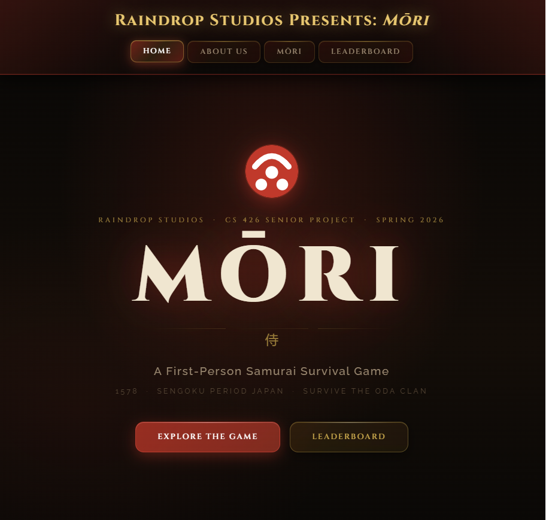

# Team-05_Raindrop Studios

## Project Webpage

### Created by Simeon Dimitrov, Samuel Mouradian, Arvind Pagidi, and Aidan Swan

    COPYRIGHT NOTICE:
        <ul style = "padding-left: 50px">
            <li>This is a repository created for Computer Science 426, which is provided by the University of Nevada, Reno. Any replication of this repository's work without permission is prohibited and discouraged. This repository is overseen by Levi Scully (the team's advisor) and Dr. David Feil-Seifer and Dr. Vinh Le (the course professors).
            </li>
        </ul>

 

This is the final webpage of Mori, a first-person combat game built with the Unity game engine. Using layered component-based architecture, the game's emphasises modularity, extensibility, and maintainability for the user and their choice of computer operating system. The system includes input handling, gameplay logic, AI behavior, UI management, and high-quality audio - all separated for organization and optimization with the layered component-based design. Taking heavy inspiration from the combat genre, Mori has evolved from its early design to now a round-based combat game that mirrors the retro arcade feel of older titles like DOOM. Major functions such as a minimalistic user interface, complex enemy AI, inventory and currency systems, as well as a map and round overlay help immerse the player.  

LINK TO WEBPAGE:

[Raindrop Studios](https://aidanswan.github.io/Mori-Webpage/)

